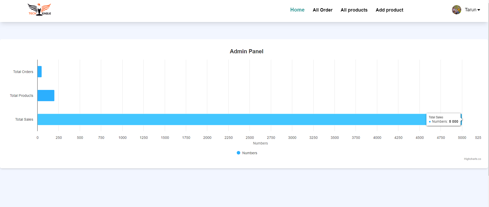
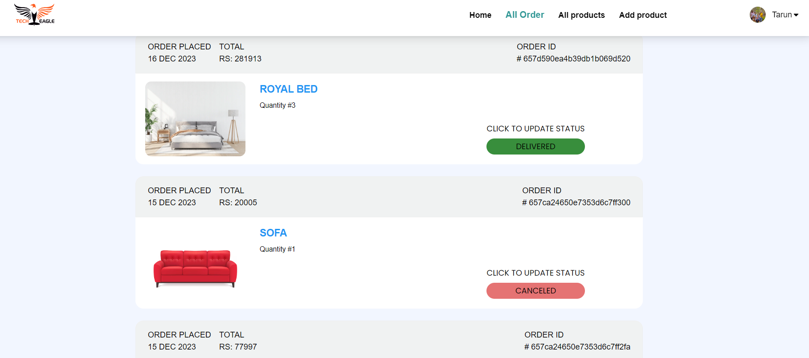
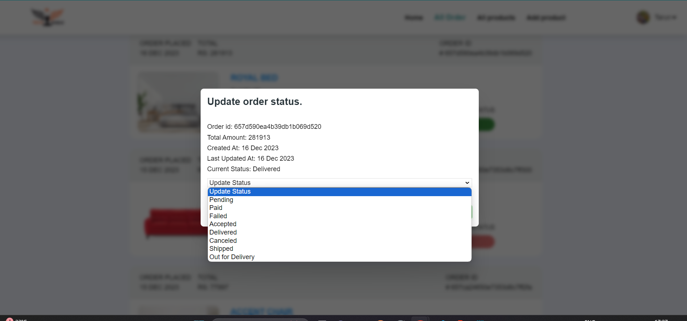
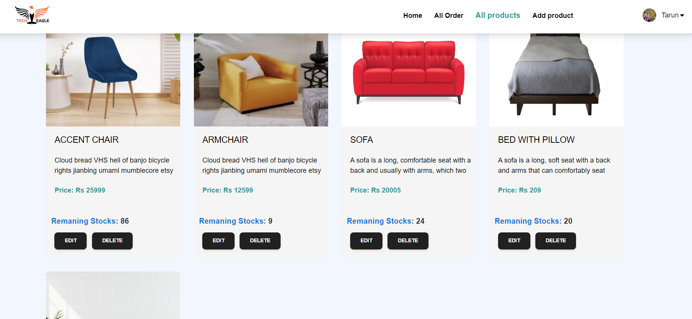
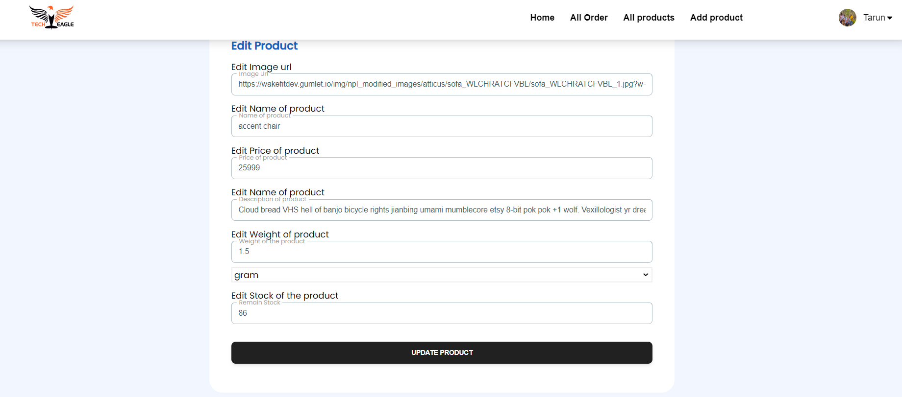
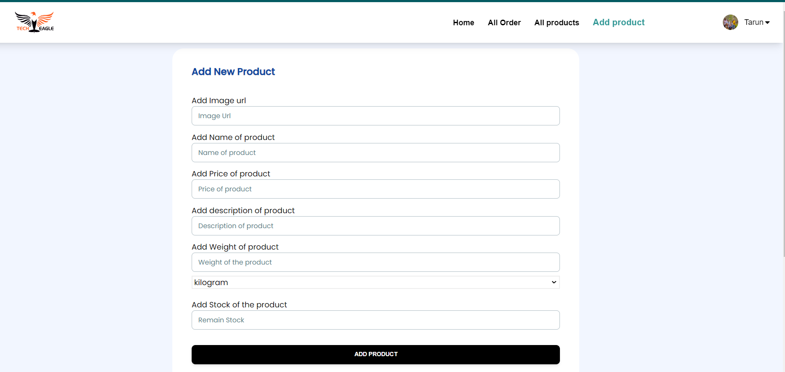
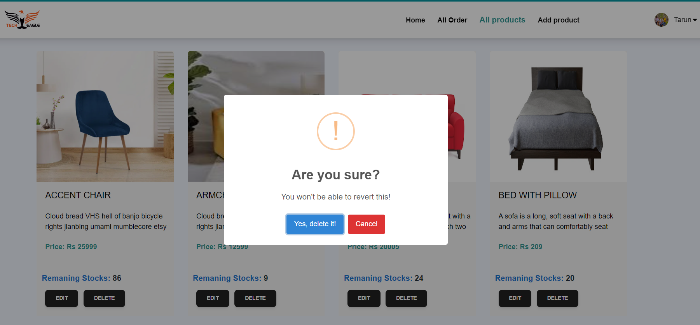
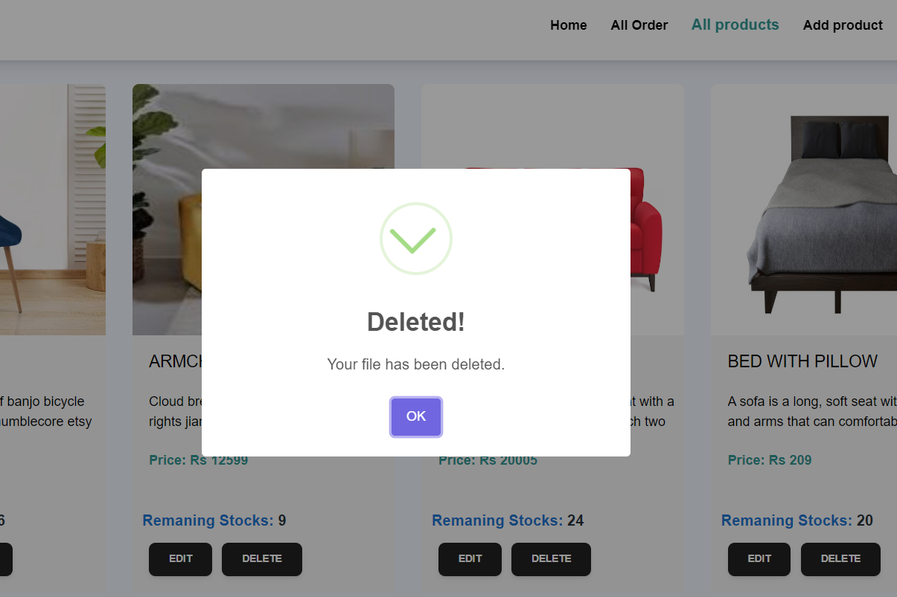

<h1 align="center">
🌐 MERN Stack App
</h1>
<p align="center">
MongoDB, Expressjs, React/Redux, Nodejs
</p>

<p align="center">
   <a href="https://github.com/amazingandyyy/mern/blob/master/LICENSE">
      
   </a>
   <a href="https://circleci.com/gh/amazingandyyy/mern">
      
   </a>
</p>

> MERN is a fullstack implementation in MongoDB, Expressjs, React/Redux, Nodejs.

MERN stack is the idea of using Javascript/Node for fullstack web development.
### Credential of Manager 
```
email: manager@techeagle.com
password: manager123
```
# Tech Eagle Full Stack Coding Assignment.

---

This Ecommerce Website project represents a robust platform that integrates backend and frontend technologies to offer a seamless online shopping experience. Leveraging Node.js for the backend, React.js for the frontend, and MongoDB for the database, this application encompasses a comprehensive set of functionalities catering to both customers and managers.

---

## Requirements

- For development, you will only need Node.js and a node global package, NPM, installed in your environement.

## Clone or Download

```terminal
$ git clone https://github.com/tarun-upadhyay/techEagle_FullStack_Assingment.git
$ yarn # or npm i
```

## Project structure

```terminal
frontend
    - package.json
    - src
        - index.js
        - App.jsx
     - Components
     - Pages
         ---
backend
    - package.json
    - app.js
    - controller
        - authController.js
        - allother controles..
    - DB
       - db.config.js
...
```

## Client-side usage(PORT: 3000)

```terminal
$ cd frontend          // go to frontend folder
$ yarn # or npm i     // npm install packages
$ npm start          // run it locally
```

## Server-side usage(PORT: 5000 || 8080)

```
$ cd backend          // go to client folder
$ yarn # or npm i    // npm install packages
$ npm start        // run it locally
```

### Prepare your secret

- Inside ->.env
- MONGO_URI
- JWT_SECRET
- JWT_LIFETIME

---

# Features.

### We have created this application for two different types of users such as Manager and customer.

# Customer

- Homepage of Customer's website

  

1. The website provides product information along with price information.

   

2. Detailed description of the product

   

3. For adding to cart we have to login first or signup first.

     
   

4. If we logined successfully so We will get the name of top right corner

   

5. Suppose you logined successfully and you are adding to your cart then you get pop.

   

6. If already present inside your cart then you will get errror message

   

7. Come to Cart section if you cart is empty you will see like this

     
   and have some stuff inside it.

   
   here you can increase quantity or delete it.

   

8. Now it's time to place your order simply click on place order button.

   

9. This is the order page which show case the all ordered items and their status.


 10. The order status will change when mangaer accepts it, suppose it accepted or changed status.


### The features I showed are for customers, if products do not load or orders do not appear, please wait for a few minutes. It's a cyclical issue that will be resolved after some time.

---

# Manager

## Only role manager can access this page or api-end points.

1. This page shows the Manager' store status



2.  Here Manager can manage the order status just clicking on update status.


 3. Inside all products section have two button to manage the products.
 4. After clicking on the edit button, you will be redirected to the edit page, which will contain the old product details, and you can update the product by clicking on the update product button.

 5. Add product section to adding new product to the store.



6. For deleting just simply click on delete button it will first confirm you are sure or not
   

If deleted successfully



---
# Thank you for time 
-   Thank you using this application
-   Feel free to ask any query.

[My Github](https://github.com/tarun-upadhyay)
https://github.com/tarun-upadhyay

[My Portfolio](https://tarun-upadhyay.github.io/)
https://tarun-upadhyay.github.io/

[Email ME](mailto:tarunu88@gmail.com)

---